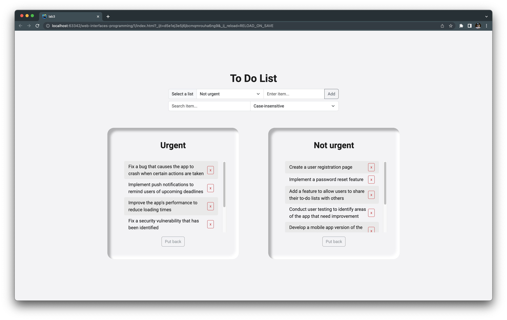
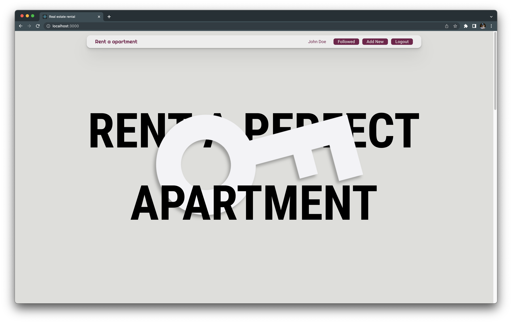
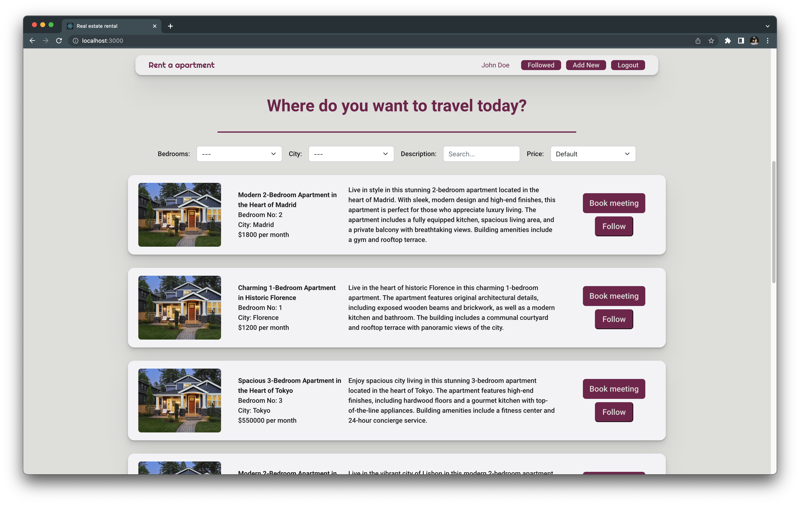
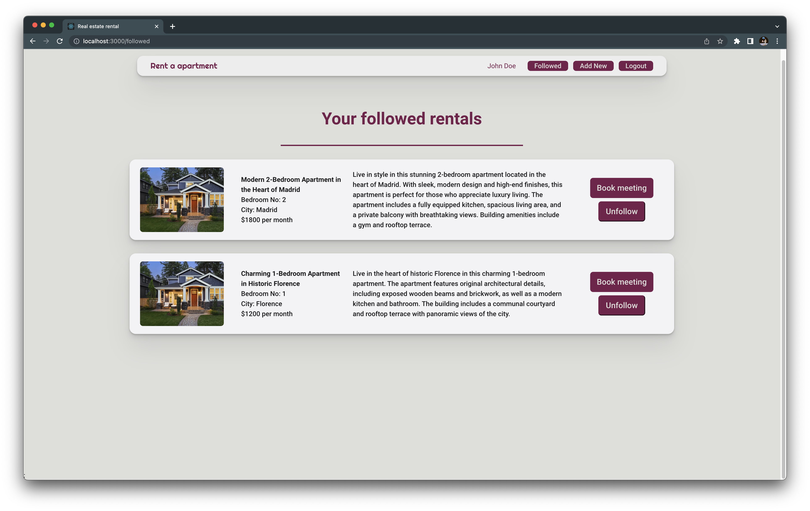
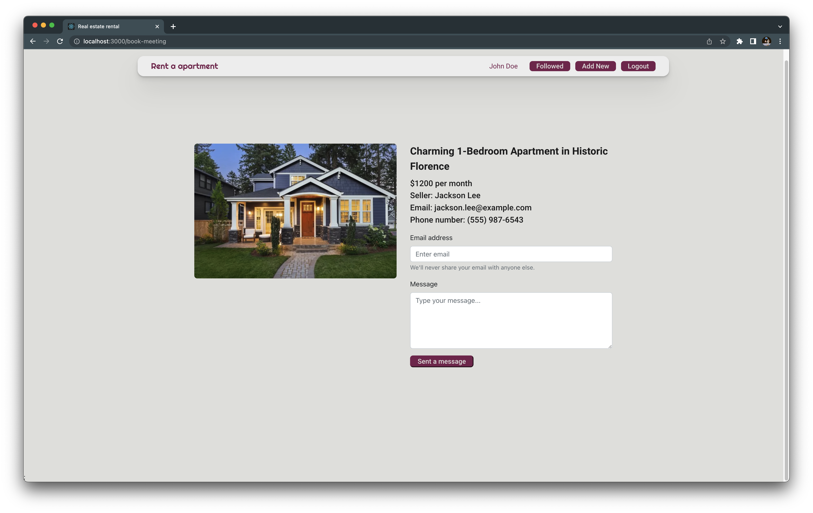
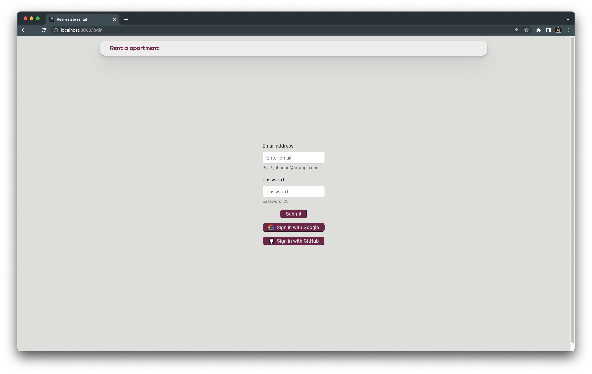

# Web Interfaces Programming
My solutions to a college course.

## Solutions
### 1 (Pure JavaScript + JQuery)
A task was to create a simple To Do website using HTML/CSS/JS and JQuery. 

The website contains two To Do lists — 'Urgent' and 'Not urgent.' Users can add, remove and put back removed tasks, as well as mark them as done and search through them with or without case sensitivity. 

> Technologies used:
> - HTML/CSS/JS
> - JQuery
> - Bootstrap

### 2 (React)
A task was to create a housing rental website using React.

   

The website contains a list of (randomly generated) housing rentals. Users can search through them with a variety of filters, follow them and book them. Followed rentals are grouped on a separate page. Users can also log in and out with a local login or Firebase. Each action status is displayed with a toast notification. The website was also deployed to Firebase (for the period of a course).

> Technologies used:
> - TypeScript
> - React
> - React Router
> - Bootstrap
> - Firebase
> - Sass
> - Axios

### 3 (Docker)
A task was to dockerize frontend, backend and database of a website provided by the professor.

> Technologies used:
> - Docker
> - Docker Compose